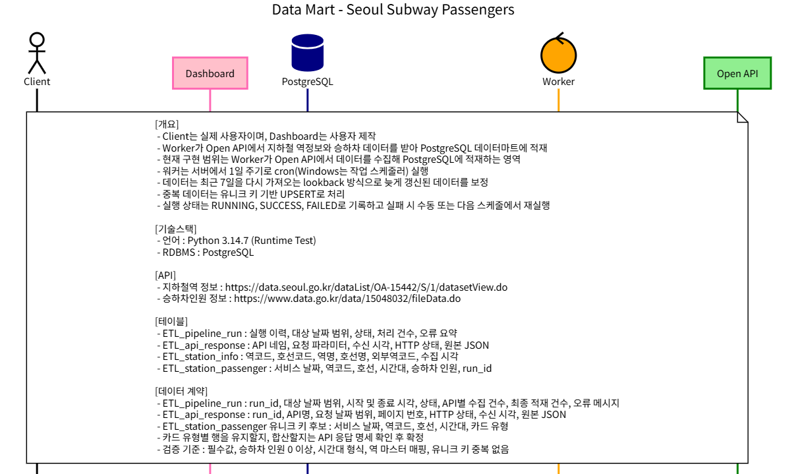
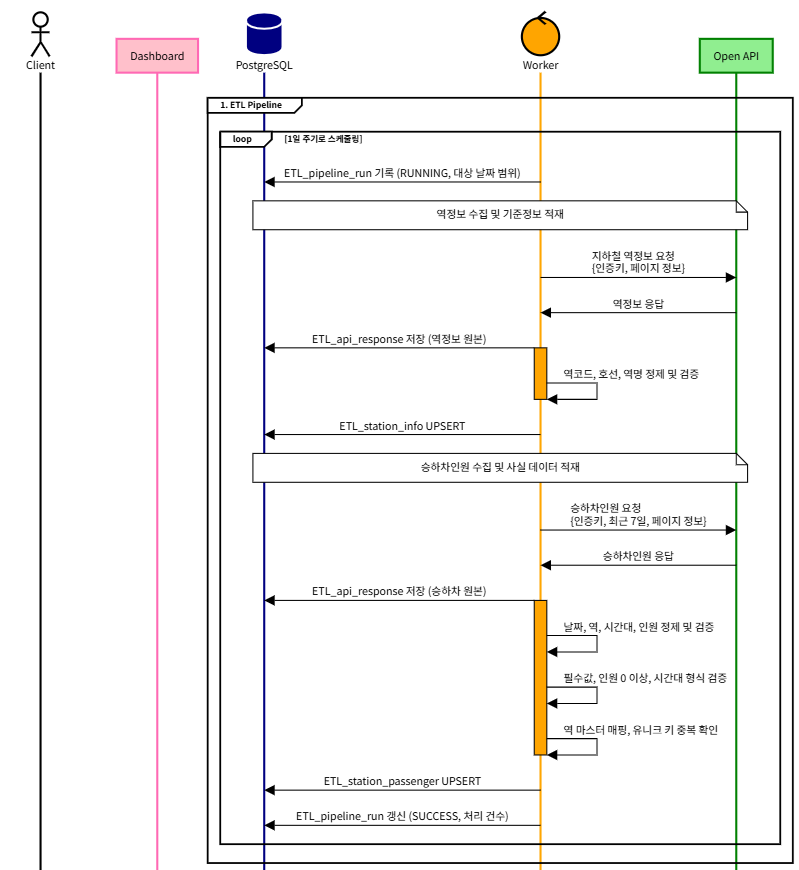
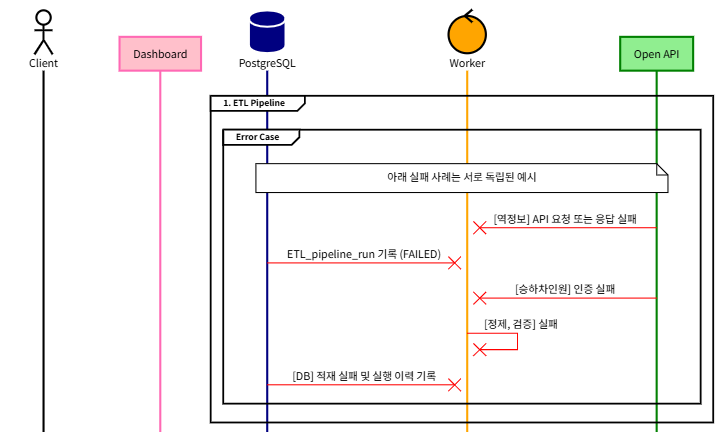
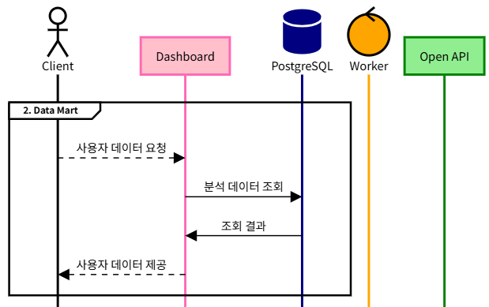

# Seoul Subway Passengers

서울 지하철 역별 승하차 공공데이터를 수집, 정제, 적재하여 역, 날짜, 시간대별 이용량 분석에 사용할 수 있게 만드는 데이터마트 ETL 프로젝트

## 프로젝트 목적

공공 API의 원본 데이터를 매일 수집하고, 중복 없이 PostgreSQL에 적재

최종적으로 다음과 같은 질문에 답할 수 있는 지하철 이용량 데이터마트를 만드는 것이 목표

- 특정 역의 시간대별 승차, 하차 인원은 얼마인가?
- 특정 노선에서 이용객이 많은 역은 어디인가?
- 최근 기간과 비교해 이용량이 증가한 역은 어디인가?

## 전체 흐름

다이어그램 원본은 [DataMartFlow.txt](DataMartFlow.txt)

### 1. 개요

지하철 공공 API에서 수집한 데이터를 Worker가 PostgreSQL 데이터마트에 적재하고, 이후 Dashboard를 통해 사용자가 조회하는 전체 구조

### 2. 데이터 적재 시나리오

Worker는 역정보와 승하차인원 API를 호출하고, 원본 응답 저장, 데이터 정제와 검증, UPSERT 적재를 순서대로 수행

### 3. 오류 처리 시나리오

API 요청과 인증, 데이터 정제, DB 적재 과정에서 발생할 수 있는 오류를 실행 이력에 FAILED 상태로 남기고, 다음 스케줄 또는 수동 실행으로 재처리

### 4. 사용자 데이터 조회 시나리오

사용자는 Dashboard에서 데이터를 요청하고, Dashboard는 PostgreSQL 데이터마트를 조회한 결과를 사용자에게 제공

## 계획 범위

- 지하철 역정보 API 수집
- 역별 승하차인원 API 수집
- 최근 7일 데이터를 다시 수집하는 lookback 처리
- 원본 API 응답 저장
- 역 기준정보, 승하차 데이터 UPSERT
- 실행 성공, 실패 이력 기록
- 데이터 검증 및 재실행 지원

## 기술 스택

| 구분 | 기술 |
| --- | --- |
| 언어 | Python 3.14.7 |
| 데이터베이스 | PostgreSQL |
| 스케줄링 | cron, Windows 작업 스케줄러 |
| 버전 관리 | Git, GitHub |
| 데이터 제공 | 서울 열린데이터광장, 공공데이터포털 |

## 데이터 테이블

| 테이블 | 설명 |
| --- | --- |
| ETL_pipeline_run | ETL 실행 이력, 상태, 처리 건수, 오류 정보 |
| ETL_api_response | API 요청 정보와 원본 응답 JSON |
| ETL_station_info | 역코드, 호선, 역명 등 역 기준정보 |
| ETL_station_passenger | 날짜, 역, 시간대별 승차, 하차 인원 |

## 테이블 컬럼 정의, 초안

### ETL_pipeline_run

| 컬럼 | PostgreSQL 타입 | 설명 |
| --- | --- | --- |
| `run_id` | UUID | 실행 식별자, 기본 키 |
| `job_name` | VARCHAR(100) | 실행한 작업 이름 |
| `target_date_from` | DATE | 수집 대상 시작 날짜 |
| `target_date_to` | DATE | 수집 대상 종료 날짜 |
| `status` | VARCHAR(20) | RUNNING, SUCCESS, FAILED 상태 |
| `started_at` | TIMESTAMPTZ | 실행 시작 시각 |
| `finished_at` | TIMESTAMPTZ | 실행 종료 시각 |
| `extracted_row_count` | INTEGER | API에서 수집한 행 수 |
| `loaded_row_count` | INTEGER | 데이터마트에 적재한 행 수 |
| `error_message` | TEXT | 실패 시 오류 요약 |

### ETL_api_response

| 컬럼 | PostgreSQL 타입 | 설명 |
| --- | --- | --- |
| `response_id` | BIGSERIAL | 원본 응답 식별자, 기본 키 |
| `run_id` | UUID | ETL_pipeline_run 참조 |
| `api_name` | VARCHAR(100) | 호출한 API 이름 |
| `request_params` | JSONB | 요청 날짜, 페이지 번호 등 요청 파라미터 |
| `http_status` | INTEGER | HTTP 응답 상태 코드 |
| `received_at` | TIMESTAMPTZ | API 응답 수신 시각 |
| `response_body` | JSONB | 원본 API 응답 JSON |

### ETL_station_info

| 컬럼 | PostgreSQL 타입 | 설명 |
| --- | --- | --- |
| `station_code` | VARCHAR(30) | 공공 API의 역 식별 코드 |
| `line_code` | VARCHAR(30) | 호선 식별 코드 |
| `station_name` | VARCHAR(100) | 역명 |
| `line_name` | VARCHAR(100) | 호선명 |
| `external_station_code` | VARCHAR(30) | 외부 역코드 |
| `collected_at` | TIMESTAMPTZ | 기준정보 수집 시각 |

`station_code`, `line_code` 조합을 기본 키 후보

### ETL_station_passenger

| 컬럼 | PostgreSQL 타입 | 설명 |
| --- | --- | --- |
| `service_date` | DATE | 이용 날짜 |
| `station_code` | VARCHAR(30) | 역 식별 코드 |
| `line_code` | VARCHAR(30) | 호선 식별 코드 |
| `time_slot` | VARCHAR(20) | 시간대 |
| `card_type` | VARCHAR(50) | 카드 유형, API 제공 여부 확인 후 확정 |
| `board_count` | INTEGER | 승차 인원 |
| `alight_count` | INTEGER | 하차 인원 |
| `run_id` | UUID | 적재를 수행한 실행 식별자 |
| `collected_at` | TIMESTAMPTZ | 원본 데이터 수집 시각 |

유니크 키 후보는 `service_date`, `station_code`, `line_code`, `time_slot`, `card_type` 카드 유형별 행을 유지할지 합산할지는 실제 API 응답을 확인한 뒤 확정

## 데이터 사용 안내

이 데이터마트는 지하철 이용량을 분석하려는 사용자와 파이프라인 실행 상태를 확인하려는 운영자를 위한 데이터

### 분석 사용 예시

- 특정 날짜, 역, 시간대의 승차 인원과 하차 인원을 조회
- 특정 노선의 역별 이용량을 비교
- 출퇴근 시간대처럼 특정 시간 구간의 이용량을 집계
- 기간별 이용량을 비교하여 증가하거나 감소한 역 파악

현재 데이터는 승하차 이용량 분석을 위한 것이며, 실시간 열차 위치나 실시간 도착 정보를 제공하지 않음

### 테이블별 사용 방법

| 사용자 | 주로 사용하는 테이블 | 사용 목적 |
| --- | --- | --- |
| 분석가, Dashboard | ETL_station_passenger, ETL_station_info | 날짜, 역, 호선, 시간대별 승하차 이용량 조회 |
| 파이프라인 운영자 | ETL_pipeline_run | 실행 성공 여부, 처리 건수, 오류 메시지 확인 |
| 데이터 개발자 | ETL_api_response | API 원본 응답 확인, 변환 오류 분석, 재처리 근거 확인 |

### 분석 데이터 조회 기준

승하차 이용량은 ETL_station_passenger를 기준으로 조회하고, 사람이 읽을 수 있는 역명과 호선명은 ETL_station_info를 결합해 확인할 수 있고, 결과적으로 날짜, 역명, 호선명, 시간대별 승차 및 하차 인원을 분석

가장 최근 데이터가 정상적으로 적재되었는지는 ETL_pipeline_run에서 가장 최근 실행의 상태가 SUCCESS인지 확인

## 데이터 품질 기준

- 필수값 누락 여부를 확인
- 승차, 하차 인원은 0 이상이어야 함
- 승하차 데이터는 역 기준정보와 매핑되어야 함
- 유니크 키 기반 UPSERT로 중복 적재를 방지
- 실패한 실행은 FAILED 상태로 기록하고 재실행할 수 있어야 함

## Version

| 버전 | 상태 | 포함 내용 |
| --- | --- | --- |
| v0.1.3 | 개발 골격 구성 | Python 의존성 목록 작성, ETL 단계별 모듈 파일 구조 구성, 실행 진입점과 각 모듈의 책임 주석 작성, Git 제외 규칙 추가 |
| v0.1.2 | 개발 준비 | PostgreSQL 테이블 스키마와 조회 인덱스 작성, ETL 폴더 구조 구성, 환경 변수 예시 파일 추가 |
| v0.1.1 | 설계 보완 | 역별승하차인원 주 데이터 출처를 일별 Open API로 변경하고, README와 흐름 문서의 API 링크를 통일 |
| v0.1.0 | 설계 단계 | 데이터마트 ETL 흐름 설계, 초기 테이블과 컬럼 정의, 데이터 품질과 재실행 기준 정의, README와 시퀀스 다이어그램 작성 |

## 데이터 출처

- [서울교통공사, 노선별 지하철역 정보](https://data.seoul.go.kr/dataList/OA-15442/S/1/datasetView.do)
- [서울교통공사, 역별승하차인원 Open API](https://www.data.go.kr/data/15143845/openapi.do)
